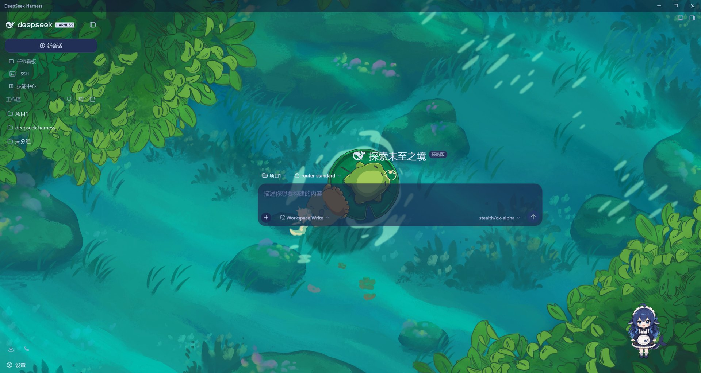

# DeepSeek Harness Desktop

[DeepSeek Harness](https://github.com/deepseek-ai/deepseek-harness)（[MIT](https://github.com/deepseek-ai/deepseek-harness/blob/main/LICENSE) 许可）的 Windows 桌面封装：双击即可启动，自动拉起内置的 `dsh web` 服务器并在 Electron 窗口中打开 Web GUI。

> ⚠️ **非官方项目**：这是个人维护的桌面封装，与 DeepSeek 官方无关。DeepSeek 及 DeepSeek Harness 商标归其各自所有者所有。

## 特性

- **点击即启动**：应用自行启动 `dsh web` 服务器，无需手动起服务、无需浏览器标签页。
- **无"拒绝连接"**：窗口只在服务器就绪（打印就绪行 **且** 返回 HTTP 200）后才打开；启动失败会弹错误对话框显示日志，而不是白屏。
- **端口零冲突**：服务器以 `--port 0` 启动，由操作系统分配空闲端口。
- **干净退出**：关闭窗口即终止服务器进程树；单实例锁防止重复启动。
- **无边框一体化窗口**：隐藏原生标题栏，页面内自绘 32px 官方风格标题栏（最小化/最大化/关闭），不遮挡 dsh 或 web-ui 插件的任何右上角按钮。
- **服务复用**：如果 `http://127.0.0.1:3080` 已有 dsh web 在运行，直接复用打开窗口，不重复启动第二个服务（避免 task-board 锁冲突）。
- **版本跟随**：独立启动时优先使用用户已安装的 dsh（全局 npm），版本永远匹配；内置 runtime 仅作最后回退。
- **dsh 自动更新**：窗口打开 30 秒后起、每 6 小时检查 npm dist-tag（默认 `next`，可配置），发现新版本时后台 `npm install -g` 升级并询问重启；每 60 秒监视本机版本，终端手动升级也能感知。
- **不弹浏览器**：拉起服务时探测 `--no-open` 支持（新版 dsh 默认把 URL 交给系统浏览器），避免桌面窗口与浏览器标签页同时弹出。
- **用户数据**：会话、设置、凭据存储在标准 `$DSH_HOME`（默认 `~/.dsh`），与 CLI/Web 版一致。

## 推荐搭配的 Web UI 插件

[dsh-web-ui](https://github.com/zhu1090093659/dsh-web-ui) —— DSH Web GUI 的**插件与皮肤全家桶**（Apache-2.0，持续更新）：



*桌面端 × dsh-web-ui 皮肤中心：Wallpaper Engine 壁纸作为界面背景的实际效果。*


- **功能插件**：梁神模式 agent 预设、任务看板、Git 图谱、右侧面板、移动端远程、SSH 运维、图像理解、鲸鱼娘宠物——每个都是独立成包的模块，可整装全家桶，也可只挑一两个；全部走官方 profile 机制挂载，不改 DSH 源码。
- **皮肤中心 v2**：皮肤是纯资产目录（skin.json + 样式/贴图/特效），由皮肤中心即时加载——与官方版本彻底解耦，官方升级不牵动皮肤，新增皮肤无需发布安装。
- **安装**：见其 README「快速开始」，支持聚合包 `@linxin666/dsh-web-ui-all` 一次装齐。

## 目录结构

```
desktop/
  main.js                    Electron 主进程（应用外壳）
  preload.js                 窗口控制 IPC 桥（contextBridge）
  appearance.js              明暗主题同步
  package.json               外壳清单
  scripts/
    prepare-runtime.js       准备服务器运行时闭包
    make-icon.js             从官方 favicon.svg 生成应用图标（需 sharp）
    build.js                 组装可分发的应用目录
  assets/deepseek.ico        应用图标（来自官方 favicon.svg）
  runtime/                   [生成] dsh 服务器运行时闭包
  dist/DeepSeek Harness/     [生成] 应用目录
```

## 构建步骤（Windows）

前置要求：[Node.js](https://nodejs.org/) ≥ 22.19（或 ≥ 24）。

```sh
cd desktop
npm install                     # 安装 Electron（postinstall 会下载二进制）
node scripts/prepare-runtime.js # 准备服务器运行时闭包
node scripts/build.js           # 组装 dist/DeepSeek Harness/
```

完成后双击 `dist/DeepSeek Harness/DeepSeek Harness.exe` 即可启动。

构建单文件便携版（可选）：

```sh
npx electron-builder --win portable --config electron-builder.config.cjs \
  --prepackaged "dist/DeepSeek Harness"
# → dist/installer/DeepSeek-Harness-<version>-portable.exe
```

> 网络受限时：Electron 二进制下载可用
> `ELECTRON_MIRROR=https://npmmirror.com/mirrors/electron/`、`ELECTRON_CUSTOM_DIR={{ version }}`、
> `electron_config_cache=<可写目录>` 加速；electron-builder 辅助二进制用
> `ELECTRON_BUILDER_BINARIES_MIRROR=https://npmmirror.com/mirrors/electron-builder-binaries/`。

## 工作原理

`main.js` 是核心（无第三方运行时依赖）：

1. 优先探测 `http://127.0.0.1:3080`；已有 dsh web 在运行则直接打开窗口复用。
2. 否则用 Electron 内置 Node（`ELECTRON_RUN_AS_NODE=1`）以 `--port 0` 拉起服务器；
   优先使用用户已安装的 dsh（`%APPDATA%\npm\node_modules\@deepseek-ai\dsh`），找不到再用内置 runtime；支持时附加 `--no-open`。
3. 解析 stdout 就绪行 `dsh web: http://127.0.0.1:<port>`，再轮询该 URL 直到 HTTP 200；
4. 然后创建无边框 `BrowserWindow`，注入 32px 官方风格标题栏（自绘最小化/最大化/关闭，经 `preload.js` IPC 控制窗口）；
5. 自动把页面右上角高度 ≤ 96px 的悬浮控件（`position: fixed/absolute`，跳过全屏层与标题栏自身）下移 32px，确保不被标题栏遮挡；
6. 服务器异常退出时显示错误对话框（可重试），关闭窗口时终止服务器进程树。
7. 窗口打开后在后台检查 `@deepseek-ai/dsh` 更新，安装完成后弹窗询问是否立即重启切换。

## 自动更新

窗口打开 30 秒后，桌面外壳会查询 npm registry 的 dist-tags 文档（`/-/package/@deepseek-ai%2Fdsh/dist-tags`），取 `DSH_DESKTOP_UPDATE_CHANNEL` 指定的 dist-tag（默认 `next`——rc 预发布走这个 tag；该 tag 不存在时回退 `latest`）。发现比当前运行版本更新时，直接用 `npm install -g @deepseek-ai/dsh@<版本>` 升级全局 dsh（与命令行共用同一份安装），完成后弹窗询问「立即重启 / 稍后」：立即重启经 `app.relaunch()` 换到新版本。

此外每 60 秒轮询本机 dsh 版本：即使你在终端手动 `npm install -g` 升级，桌面端也会感知并提示重启。

可用环境变量：

| 变量 | 默认值 | 说明 |
|---|---|---|
| `DSH_DESKTOP_NO_AUTO_UPDATE` | 未设置 | 设为 `1` 禁用自动更新 |
| `DSH_DESKTOP_UPDATE_CHANNEL` | `next` | 要跟踪的 npm dist-tag，如 `next` 或 `latest` |
| `DSH_DESKTOP_UPDATE_MODE` | `auto` | 设为 `notify` 时，发现 dsh 新版先弹窗确认再安装（默认静默安装后仅提示重启） |
| `DSH_DESKTOP_REGISTRY` | 跟随 npm 全局配置 | 覆盖检查/安装使用的 npm registry（如 `https://registry.npmmirror.com` 镜像） |
| `DSH_DESKTOP_GLOBAL_ROOT` | 自动探测 | 覆盖全局 dsh 的查找根目录 |
| `DSH_DESKTOP_NATIVE_TITLEBAR` | 未设置 | 设为 `1` 回退原生标题栏 |
| `DSH_WEB_URL` | `http://127.0.0.1:3080` | 覆盖服务复用探测地址 |

如果机器上没有 `npm`、网络不可用、或设置了 `DSH_DESKTOP_SMOKE=1`（冒烟测试），自动更新会跳过并记录日志，不影响当前 dsh 运行。

> 回滚：每次自动升级前会把当前版本记录到 `%APPDATA%/deepseek-harness-desktop/dsh-previous-version.json`；新版本有问题时执行 `npm i -g @deepseek-ai/dsh@<记录的 previous>` 即可退回，桌面端会感知并提示重启。

## 桌面壳自更新

从 v0.1.1 起，桌面壳支持**自我更新**（与上面的 dsh 运行时自动更新相互独立）：

1. 启动 60 秒后查询本仓库的 [latest release](https://github.com/123WP-a/deepseek-harness-desktop/releases/latest)，之后每 24 小时复查一次；
2. 发现更高版本时下载资产 `app.asar` 与 `SHA256SUMS`，**先做 SHA256 校验**，通过才继续；
3. 校验通过后弹窗询问「立即重启安装 / 稍后」；选择安装会退出当前实例（旧版自动备份为 `app.asar.bak-selfupdate-<版本>`）、换入新版并自动重启。

可用环境变量：`DSH_DESKTOP_NO_SELF_UPDATE=1` 关闭；`DSH_DESKTOP_SELF_UPDATE_REPO` 覆盖检查的仓库（默认 `123WP-a/deepseek-harness-desktop`）。

> 注意：Release 资产下载走 `objects.githubusercontent.com`，无代理的受限网络下可能失败——失败会静默跳过，不影响使用。

## 安全边界

- 渲染层：`contextIsolation` + `sandbox` 开启、`nodeIntegration` 关闭；页面仅能通过 `preload.js` 暴露的最小窗口控制桥与主进程通信。
- 导航锁：主窗口只允许停留在本机 dsh 服务的同源页面；其他目标一律拦截，http(s) 转交系统浏览器打开。
- 弹窗策略：页面发起的 `window.open` 同源走应用内窗口、外链转系统浏览器、其余 scheme 直接拒绝——不存在同权限弹窗注入面。
- 权限请求：摄像头/麦克风/地理位置/通知等一律拒绝（Web UI 无此需求）。
- 桌面壳自更新：仅接受比当前版本更高的 Release；下载内容先过 SHA256 校验、再过 asar 结构校验（帧格式 + 四个入口成员），双门通过才会暂存换装。
- CI：Actions 全部固定到 commit SHA，工作流不使用任何 secrets。

## 许可

- 本项目代码：MIT（见 [LICENSE](./LICENSE)）。
- 基于 [deepseek-ai/deepseek-harness](https://github.com/deepseek-ai/deepseek-harness)（MIT），运行时随 Electron 分发。
- 图标来自官方仓库的 `apps/web/public/favicon.svg`（黑色鲸鱼 logo），仅作标识用途。

## 已知限制

- 仅支持 Windows（目标平台 win32-x64）；macOS/Linux 需调整 `main.js` 的进程树终止逻辑。
- 桌面版与浏览器版 `dsh web` 使用同一 `$DSH_HOME`；两者同时运行可能产生会话写入竞争。桌面端已优先复用已运行的 3080 服务以降低冲突，但建议仍只开其一。
- 无边框标题栏默认开启；如遇异常可设环境变量 `DSH_DESKTOP_NATIVE_TITLEBAR=1` 回退原生标题栏。
