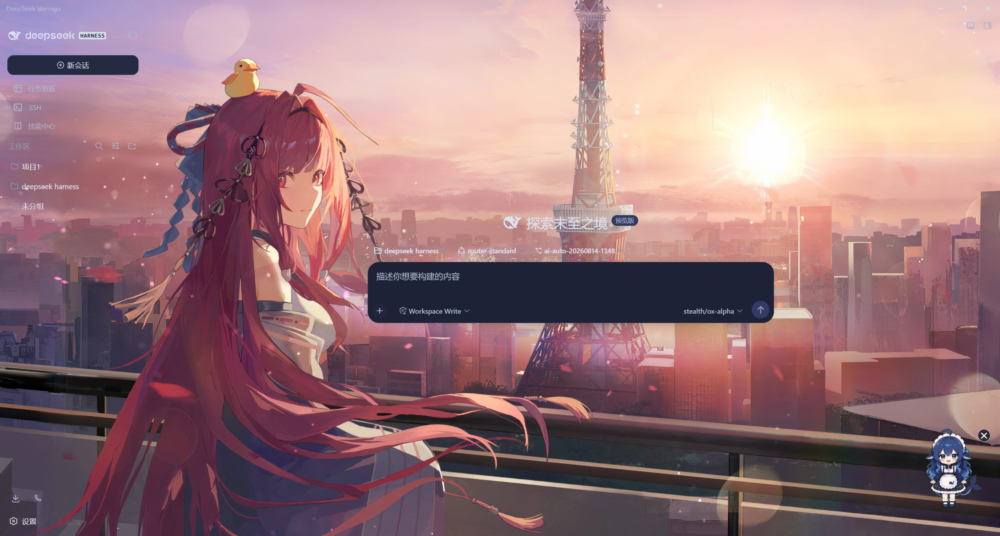

# DeepSeek Harness Desktop

<div align="center">

  

**双击即用的本地 AI 编码工作台** —— Electron 封装 + 内置 dsh web 服务，会话、密钥、代码全程留在本机。

[English](README.zh.md) | 中文

</div>

---

## 📸 预览

**Wallpaper Engine 动态壁纸 × Web UI**（创意工坊皮肤效果实拍）：



## 目录

- [✨ 功能总览](#-功能总览)
- [🚀 快速开始](#-快速开始)
- [🖥️ 桌面体验详解](#️-桌面体验详解)
- [🧩 推荐搭配生态](#-推荐搭配生态)
- [⚙️ 配置项大全](#️-配置项大全)
- [📁 数据与文件位置](#-数据与文件位置)
- [🛠️ 安全模式详解](#️-安全模式详解)
- [❓ 常见问题](#-常见问题)
- [⬇️ 下载](#️-下载)
- [⚖️ 免责声明](#️-免责声明)

## ✨ 功能总览

### 一、开箱即用

- **点击即启动** —— 应用自动拉起内置的 dsh web 服务，并等待服务真正就绪（打印就绪行且 HTTP 探测通过）后才打开窗口。无需安装 Node.js、无需打开终端、不会出现「连接被拒绝」的白屏。
- **端口零冲突** —— 服务以动态端口启动，操作系统分配空闲端口，默认端口被占用也永不阻塞。若检测到已有本机服务在运行，则直接复用而不重复启动。
- **单实例锁** —— 手快多点几次图标也不会拉起第二份服务打架；重复点击只会把已有窗口带回前台。
- **干净退出** —— 关闭窗口即终止整个服务进程树（含所有子进程），不留后台僵尸。

### 二、桌面集成

- **系统托盘常驻** —— 托盘图标常驻通知区域，菜单支持「显示主窗 / 退出」；配合关闭行为设置，可实现关窗后继续在后台运行任务。
- **全局快捷键** —— Ctrl/Cmd+Shift+H 随时呼出主窗口并聚焦，无论当前在其他应用何处。
- **开机自启（可选）** —— 在配置中开启后随系统登录自动启动，开机即在托盘待命。
- **长任务防休眠** —— 检测到后台工作运行期间自动阻止系统进入休眠，挂机跑长任务不再被睡眠打断；任务结束后自动恢复。
- **任务栏状态提示** —— 任务运行时任务栏图标显示进行中的不确定进度条，结束后自动清除，一眼可知忙闲。
- **主题跟随** —— 浅色 / 深色 / 跟随系统三种外观，标题栏、滚动条与页面同步切换，由 Web UI 的外观设置实时驱动。

### 三、智能守护

- **退出保护** —— 有活跃后台任务（作业运行中）时关闭窗口，会先弹出确认对话框而不是直接终止一切，防止误杀跑了半小时的工作。
- **审批 OS 通知** —— AI 请求执行敏感操作（写敏感文件、执行命令等）需要你批准时，Windows 系统通知直接弹出提醒；人不在电脑前也不会让流程干等。
- **外链三分拦截** —— 对话与终端里的网页链接自动转交系统默认浏览器打开；同源弹窗留在应用内；其他协议一律拒绝，应用窗口永远不会被导航走或弹出来路不明的第二个渲染窗。

### 四、可靠性设计

- **安全模式逃生门** —— 第三方插件导致服务无法启动时，错误对话框提供「以安全模式重启」：本次启动禁用全部第三方插件（你的用户补丁层会先备份、窗口打开后自动还原），快速定位问题插件。
- **自动更新 + 供应链指纹校验** —— 后台检查新版本并暂存下载，暂存时记录关键工件的 SHA-256 指纹，下次启动激活前重新校验——损坏或被篡改的更新直接拒用。
- **崩溃恢复** —— 服务意外停止时给出明确错误信息与服务日志尾部，一键重新launch而非白屏。
- **内存健康** —— 子进程输出按行消费并有缓冲上限，长时间挂机不涨内存。

## 🚀 快速开始

1. 到 Releases 下载最新版本（应用目录版或便携单文件版）。
2. 双击启动应用。
3. 首次使用：在 设置 → 模型 中粘贴你的 API Key（自带格式校验），选择默认模型。
4. 开始对话 —— 让它读写你的项目、执行命令、管理后台任务。

> 💡 推荐前往 设置 → 插件 / 创意工坊 安装社区扩展解锁更多玩法（见下文生态推荐）。

## 🖥️ 桌面体验详解

### 托盘与关闭行为

- 托盘图标左键单击 = 显示主窗；右键菜单含「显示主窗 / 退出」。
- 关闭行为两种模式：quit（默认，关窗即退出并终止服务树）与 tray（关窗最小化到托盘，服务与后台任务继续运行）。切换方式见配置项大全。
- 托盘「退出」永远执行完整退出：终止服务进程树 + 注销快捷键 + 清理电源保活。

### 退出保护

- 壳持续监视后台作业注册表：只要存在「运行中 / 停止中」的任务，关闭主窗就会先弹出确认框。
- 确认框提供「仍然关闭 / 取消」两个选项；选择取消后可安心等任务收尾，或切到托盘模式让它后台跑完。
- 任务全部结束（成功或失败）后，守卫自动解除，下次关窗不再打扰。

### 自动更新

- 首个窗口打开约 15 秒后进行一次检查（环境变量可调延迟或彻底关闭）。
- 发现新版本时后台下载暂存到用户数据目录，同时记录关键工件的 SHA-256 指纹。
- 下次启动激活前重新校验指纹：损坏或被篡改的暂存会被直接拒用，绝不带病上线。
- 渠道与 registry 支持在配置中指定，默认跟随 next 渠道、官方 npm registry。

## 🧩 推荐搭配生态

dsh-web-ui —— DSH Web GUI 的插件 / 皮肤全家桶（Apache-2.0，持续更新）：

- **创意工坊**：浏览社区市场，npm 包名或 Git 地址一键安装插件与皮肤；
- **插件管理器**：已装插件的启用/禁用/修复/卸载，安装冲突自动仲裁；
- **皮肤中心**：多套主题皮肤随心换；
- **SSH 终端 / Git 提交图 / 任务看板 / 移动端远程访问 / 桌面宠物** 等面板一应俱全。

与本桌面端无缝搭配：创意工坊一键安装的插件即刻生效，配合桌面端的安全预装扫描与退出守卫，玩得放心。

**⬇ 前往下载 dsh-web-ui 插件包：[https://github.com/zhu1090093659/dsh-web](https://github.com/zhu1090093659/dsh-web)**

## ⚙️ 配置项大全

以下键位于 settings.yaml（默认 ~/.dsh/settings.yaml），与 Web UI 设置页共存于同一文档：

| 配置键 | 默认值 | 说明 |
|---|---|---|
| desktop.closeBehavior | quit | 关闭窗口行为：quit 退出应用 / tray 最小化到托盘 |
| desktop.autostart | false | 是否随系统登录自动启动 |
| desktop.updateChannel | next | 自动更新跟随的 npm dist-tag |
| desktop.updateRegistry | npm 官方源 | 自动更新使用的 npm registry |
| ui-theme.preference | system | 外观偏好 |

高级环境变量（一般无需改动）：DSH_DESKTOP_UPDATE_DELAY_MS（更新检查延迟）、DSH_DESKTOP_DISABLE_UPDATE=1（关闭自动更新）、DSH_DESKTOP_UPDATE_CHANNEL / DSH_DESKTOP_REGISTRY（渠道兜底）、DSH_DESKTOP_PROFILE（指定 profile）。

## 📁 数据与文件位置

| 内容 | 位置（默认） |
|---|---|
| 会话记录 | $DSH_HOME/sessions/（JSONL 持久化 + SQLite 查询缓存） |
| 设置文档 | $DSH_HOME/settings.yaml |
| 凭据（加密存储） | $DSH_HOME/.credentials.yaml |
| 工具调用审计 | $DSH_HOME/audit/tool-calls.jsonl（仅记名称/状态/时序，不含参数与结果内容） |
| 更新暂存目录 | %APPDATA%/DeepSeek Harness/runtime-next/（含指纹标记） |

## 🛠️ 安全模式详解

当服务因第三方插件无法启动时：

1. 错误对话框会出现「Relaunch in safe mode（以安全模式重启）」按钮；
2. 选择后，壳会备份用户补丁层（cordis.patch.yml.safe-backup），再临时追加禁用行禁用全部第三方插件条目，然后正常拉起服务；
3. 窗口打开后即恢复正常使用，下一次启动自动还原补丁层；
4. 整个过程原始配置始终有备份，随时可回退。

## ❓ 常见问题

**Q：插件把环境搞坏了怎么办？**
启动失败的错误框上选「Relaunch in safe mode」，即可禁用全部第三方插件进入系统；定位到问题插件后在插件管理器卸载即可。

**Q：关窗后后台任务还在跑吗？**
取决于关闭行为设置：默认 quit 会连同任务一起结束；切到 tray 模式则继续运行，且有退出保护防误关。

**Q：为什么有时点更新没反应？**
更新检查依赖网络可达 npm registry；网络受限时检查会静默跳过，下次启动自动重试。也可用环境变量手动指定渠道。

**Q：如何完全退出？**
托盘菜单选「退出」，或在默认模式下直接关闭窗口。

## ⬇️ 下载与安装

### 方式一：便携版（推荐）

1. 前往 [Releases](https://github.com/123WP-a/deepseek-harness-desktop/releases) 页面；
2. 找到最新版本（如 v0.1.7），下载 `DeepSeek-Harness-x.x.x-portable.exe`（约 109 MB）；
3. 双击运行即可——无需安装、无需管理员权限、自动解压到临时目录并启动。

> 首次启动会稍慢（自解压过程），之后正常。

### 方式二：从源码构建

```powershell
git clone https://github.com/123WP-a/deepseek-harness-desktop.git
cd deepseek-harness-desktop/desktop
npm install
npm run build
npm start
```

> 构建需要 Node.js ≥ 18 和 npm。`npm start` 会以开发模式启动 Electron 壳并拉起内置 dsh web 服务。

### 系统要求

| 项目 | 要求 |
|---|---|
| 操作系统 | Windows 10 (1809+) / Windows 11 |
| 网络 | 首次使用需联网获取 API Key 验证；日常使用可离线（本地模型除外） |
| API Key | [DeepSeek 平台](https://platform.deepseek.com/) 获取 |

### SHA-256 校验

每个 Release 附带 `SHA256SUMS` 文件。下载后建议校验完整性：

```powershell
Get-FileHash .\DeepSeek-Harness-x.x.x-portable.exe -Algorithm SHA256
# 对比 SHA256SUMS 文件中的哈希值是否一致
```


## ⚖️ 免责声明

本项目为个人维护的非官方桌面封装，与 DeepSeek 官方无关；相关商标归其各自所有者所有。仅供学习交流使用。

